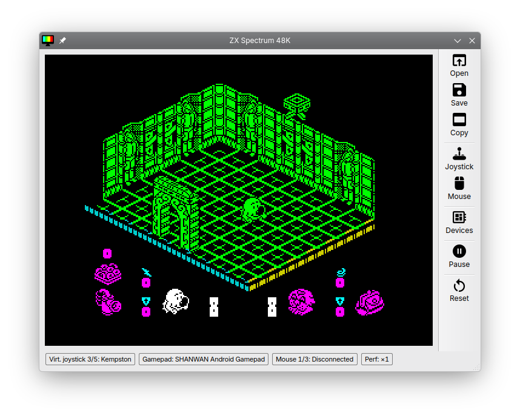
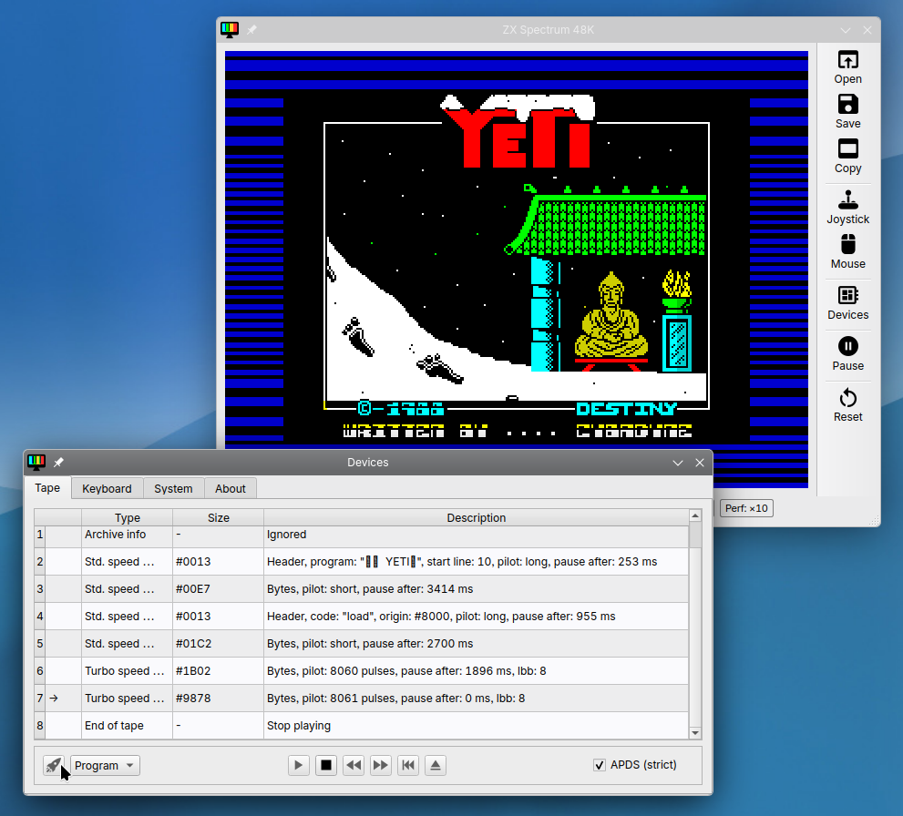
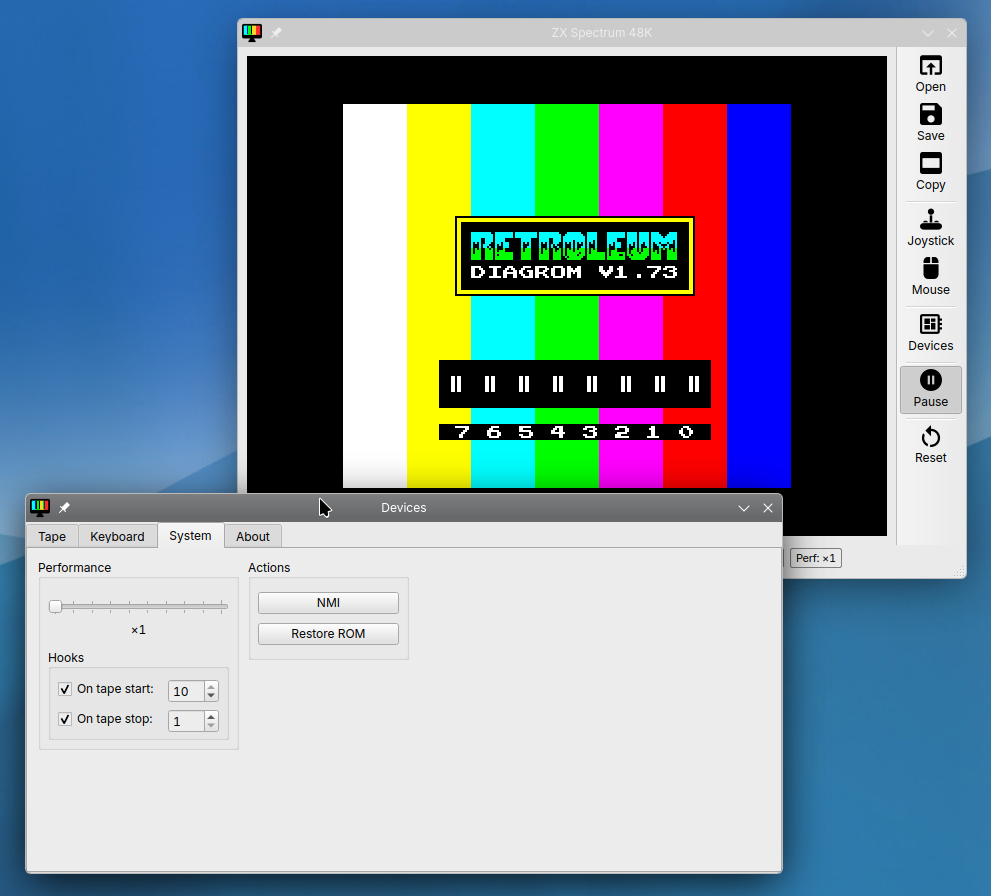
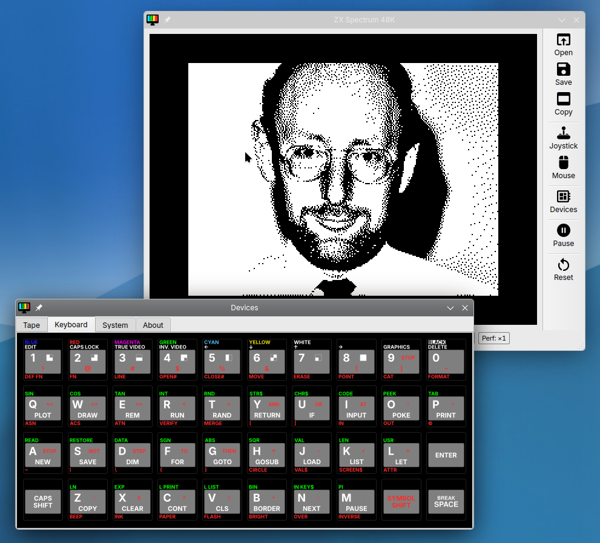

# RISE — High-Precision ZX Spectrum 48K Emulator

[](COPYING)
[](https://github.com/dmitry-starushko/rise/releases)
[](https://boosty.to/rise_emulator)

**RISE** is a modern, high-precision ZX Spectrum 48K emulator focused on cycle-accurate Z80 emulation, authentic audio experience, smart tape handling, and flexible input options.



---

## Features

### Core Emulation
- **Cycle-accurate Z80 CPU** emulation for authentic timing
- **ZX Spectrum 48K** hardware compatibility
- **Advanced beeper audio** with high-quality sound processing
- **2x display scaling** (512×384) — original 256×192 resolution doubled for comfortable viewing on modern monitors
- **Speed boost up to x10** for faster tape loading and testing

### Input Devices
- **Full ZX Spectrum keyboard** layout with intuitive host mapping
- **Virtual on-screen keyboard** for mouse-based input
- **Physical gamepad support via SDL3** — direct HID access, no extra drivers or mapping tools. Works with Xbox, PlayStation, Nintendo Switch Pro, and generic USB controllers.
- **Keyboard joystick emulation** — arrow keys for movement, Left Alt for fire. Works alongside gamepad input on the same virtual joystick.
- **Joystick support**:
  - **Kempston** — widely used third-party joystick interface
  - **Sinclair Interface 2** — supports two joysticks (left/right ports) via a single standard
  - **Cursor | Protek | AGF**
- **Mouse support**: Kempston mouse standard with optional **inverted button mapping** (some software uses opposite bit assignments for left/right buttons)

### Tape Emulation (TAP & TZX)
- **Full TZX block support** per the [TZX specification](https://worldofspectrum.net/TZXformat.html), including:
  - Standard and turbo speed data blocks
  - **JUMP**, **LOOP**, and **CALL** blocks for program flow control
  - **MESSAGE** blocks for on-screen text during loading
  - **SELECT** blocks for user-interactive loaders
  - All standard and extended block types
- **Auto-detect tape port polling** — virtual tape starts/stops automatically
- **Turbo loading** — accelerate tape loading up to 10x without breaking compatibility
- **TAP format** support for simple cassette images

### Snapshots & ROM
- **Z80 snapshot** save/load for quick game state preservation
- **Custom ROM loading** — use your own ROM dumps (typically 16 KB, but smaller dumps are also supported)
- Included ROM with Amstrad plc permission (see [bin/README.copyright](bin/README.copyright))

### User Interface
- **Qt6-based** clean and responsive GUI
- **Real-time control panel** for settings adjustment
- **Contextual hints** for all controls (hover over buttons for shortcuts)
- **Cross-platform**: Linux and Windows

---

## Quick Start

### Linux (AppImage)

```bash
# 1. Download the AppImage from Releases
wget https://github.com/dmitry-starushko/rise/releases/download/v1.0.0/rise-1.0.0-x86_64.AppImage

# 2. Make it executable
chmod +x rise-1.0.0-x86_64.AppImage

# 3. Run
./rise-1.0.0-x86_64.AppImage
```

### Windows (Installer)

1. Download `rise-1.0.0-windows-x64-installer.exe` from [Releases](https://github.com/dmitry-starushko/rise/releases)
2. Run the installer and follow the setup wizard
3. Launch RISE from the Start Menu or desktop shortcut

> **Note**: The installer includes all required Qt6 runtime DLLs. No additional dependencies needed.

### Firmware Files

RISE includes the following firmware files:

| File | Purpose | License |
|------|---------|---------|
| `bin/zx-spectrum-48.rom` | Standard ZX Spectrum 48K BASIC | © Amstrad plc (redistribution permitted) |

See [bin/README.copyright](bin/README.copyright) for full licensing details.

> **Custom ROM**: You may replace the included ROM with your own dump. Use `File → Load ROM` or drag & drop a ROM file (typically 16 KB, but smaller dumps are supported) into the emulator window.

---

## Documentation

| Document | Description |
|----------|-------------|
| [**User Guide (EN)**](docs/USAGE.md) | Complete user guide in English |
| [**Руководство (RU)**](docs/USAGE.ru.md) | Полное руководство на русском языке |
| [**Build Instructions**](docs/BUILD.md) | Compile from source on Linux/Windows (CMake 3.30+, SDL3, Qt6) |
| [**License**](COPYING) | GPL-3.0 for emulator code |
| [**Firmware Notice**](bin/README.copyright) | Copyright info for included ROM file |

> **Tip**: All keyboard shortcuts are shown as tooltips — just hover over any button in the interface.

---

## Smart Tape Loading

RISE makes loading games from virtual tapes effortless:

| Feature | Description |
|---------|-------------|
| **Auto-start** | Tape begins playing when the Spectrum polls the tape port |
| **Auto-stop** | Tape stops automatically after loading completes |
| **Turbo mode** | Speed up loading up to 10x — no need to wait for original timings |
| **Full TZX** | Complex loaders with JUMP/LOOP/CALL/MESSAGE/SELECT blocks work correctly |

> Just open a TAP or TZX file and let RISE handle the rest!

---

## Gamepad & Keyboard Joystick Support

RISE provides flexible input options for joystick-controlled games:

### Physical Gamepad (via SDL3)
- **Direct HID access** — no extra drivers or mapping tools (JoyToKey, x360ce, etc.)
- **Supported controllers**:
  - Xbox controllers (wired & wireless via Bluetooth)
  - PlayStation controllers (DualShock 4, DualSense)
  - Nintendo Switch Pro Controller (via HIDAPI)
  - Generic USB gamepads with HID support
- **Auto-detection** — just plug it in or connect via Bluetooth

### Keyboard Joystick Emulation
- **Arrow keys** — movement (up, down, left, right)
- **Left Alt** — fire button
- These keyboard inputs are mapped to the **same virtual joystick** as the physical gamepad. You can switch between them seamlessly or use both simultaneously.

### Joystick Modes
Select your preferred joystick type in **Devices → Joystick**:

| Mode | Description | Best For |
|------|-------------|----------|
| **Kempston** | Widely used third-party joystick interface | Most games |
| **Sinclair Interface 2** | Two-joystick support via single standard (left/right ports) | Games with dual controls |
| **Cursor** | Cursor keys emulation (aka Protek / AGF) | Text adventures, utilities |

> **Note**: Keyboard arrow keys and Left Alt work in **all** joystick modes. The physical gamepad follows the same mapping rules.

---

Хорошо, я ничего не меняю в тексте. Просто привожу вывод скриншотов **один за другим, в одну колонку** (без таблиц).

---

## Screenshots


*Main emulator window with game running*

---



*Tape loading with auto-detection*

---



*Control panel for real-time configuration*

---



*Virtual on-screen keyboard*

---

> **Have a great screenshot?** Share it in [Discussions](https://github.com/dmitry-starushko/rise/discussions) — the best ones may be featured here!

---

## Where to Get Games

RISE does not include commercial games. You can download games from these legal sources:

| Source | Type | Notes |
|--------|------|-------|
| [Spectrum Computing](https://spectrumcomputing.co.uk/) | Freeware, Homebrew | Filter by "Available" + "Freeware" |
| [World of Spectrum Archive](https://worldofspectrum.org/archive) | Historical archive | Includes permissions from rightsholders |
| [itch.io — ZX Spectrum](https://itch.io/games/free/tag-zx-spectrum) | Modern homebrew | Many CC-licensed indie games |

> **Note**: Commercial games (Manic Miner, Jet Set Willy, etc.) remain under copyright. "Abandonware" is not a legal status — always verify distribution rights.

---

## Building from Source

### Dependencies
- CMake >= 3.30
- Qt6 (Core, Widgets, Svg, Multimedia)
- SDL3 (gamepad support)
- C++23 compiler (GCC 15+, Clang 21+)

### Build Steps

```bash
git clone https://github.com/dmitry-starushko/rise.git
cd rise
mkdir build && cd build
cmake ..
make
```

For detailed instructions, see [docs/BUILD.md](docs/BUILD.md).

---

## Support the Project

RISE is free, open-source software. If you find it useful, consider supporting continued development:

[](https://boosty.to/rise_emulator)

Your donations help with:
- Bug fixes and stability improvements
- New features (ZX Spectrum 128K + AY sound is planned!)
- Building and distributing releases
- Coffee for the developer

> **Note**: Donations support **emulator development**, not ROM files. ROMs are included with permission from Amstrad plc under their redistribution policy.

---

## License

| Component | License | Copyright |
|-----------|---------|-----------|
| **Emulator Code** | [GPL-3.0-or-later](COPYING) | © 2024-2026 Dmitry Starushko |
| **zx-spectrum-48.rom** | Proprietary (redistribution permitted) | © Amstrad plc |

See [bin/README.copyright](bin/README.copyright) for full licensing terms.

---

## Contact & Support

- **Bug Reports**: [GitHub Issues](https://github.com/dmitry-starushko/rise/issues)
- **Questions & Ideas**: [GitHub Discussions](https://github.com/dmitry-starushko/rise/discussions)
- **Email**: dmitry.starushko@gmail.com

---

## Acknowledgments

- ZX Spectrum and ROM images © Amstrad plc — used with permission
- Thanks to the ZX Spectrum community for testing and feedback
- Built with [Qt6](https://www.qt.io/), [Boost](https://www.boost.org/), and [SDL3](https://www.libsdl.org/)

---

*Last updated: March 2026*
